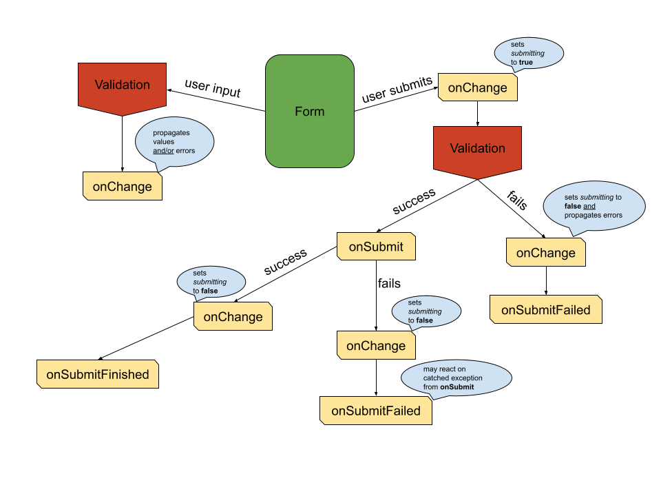

[![GitHub license][license-image]][license-url]
[![npm package][npm-image]][npm-url]
[![GitHub Push][push-image]][push-url]
[![Coverage Status][coveralls-image]][coveralls-url]

#  morfi

Abstract form handling for any purpose (2.3 kb gzipped)

## Why morfi?

It offers simply one thing that I couldn't find in any other library. That is type safety.
I've invested a lot of work to find the most convenient way to ensure type safety. In addition,
I wanted to create a library with minimal footprint, i.e. no further dependencies, tiny bundle
size, high runtime performance.

* Type safe with `TypeScript` support
* No dependencies
* Small bundle size
* High performance
* Freely customizable form elements
* [Testing utility](./test-utils/README.md)

## Installation

```sh
npm i --save morfi
pnpm add morfi
```

## Introduction

Let's get a first impression... Imagine you have created your own custom component to display
and update some state like the following.

```tsx
type User = { ID: string; name: string };
type UserPickerProps = { users: User[]; userID?: string; onPick: (user: User) => void };

const UserPicker: React.FC<UserPickerProps> = ({ users, userID, onPick }) => (
  <ul>
    {users.map((user) => (
      <li
        key={user.ID}
        className={userID === user.ID ? 'active' : undefined}
        role="button"
        onClick={() => onPick(user)}>
        {user.name}
      </li>
    ))}
  </ul>
);
```

To make this a picker that can be used directly in a form you need to create a wrapper form
component for a specific field.

```tsx
import { useCallback } from 'react';
import { Morfi, FormField } from 'morfi';

type FormUserPickerProps = { field: FormField<string | undefined>; users: User[] };

const FormUserPicker: React.FC<FormUserPickerProps> = ({ users, field }) => {
  const { value, onChange } = Morfi.useField(field);
  const onPick = useCallback((user: User) => onChange(user.ID), [onChange]);

  return <UserPicker users={users} userID={value} onPick={onPick} />;
};
```

And finally, you can use this custom form element in your form.

```tsx
import { useState } from 'react';
import { Morfi, MorfiData } from 'morfi';

type FormValues = { userID?: string };
type MyFormProps = { users: User[]; onSubmit: (values: FormValues) => Promise<void> };

const MyForm: React.FC<MyFormProps> = ({ users, onSubmit }) => {
  const { Form, fields } = Morfi.useForm<FormValues>();
  const [data, setData] = useState<MorfiData<FormValues>>(Morfi.initialData({}));

  return (
      <Form onSubmit={onSubmit} data={data} onChange={setData}>
        <FormUserPicker users={users} field={fields.userID} />
      </Form>
  );
};
```

## Asynchronous form field handling

To implement async form field validation, you simply have to return a promise, which
will resolve the validation result. You can write validators which are both:
**async** *AND* **sync** validator at the same time. One example:

```js
import type { Validator } from 'morfi';

const specialValidator: Validator<string> = (val?: string) => {
    if (!val) { // if value is falsy we return sync error
        return {id: 'value.required'};
    }
    return myFetch('/my/api').then(result => {
        if (result.isInvalid) { // api answered that the value was invalid
            return {id: 'value.invalid'}; // return async error
        }
    });
}
```

HINT: You should always validate the value `undefined` synchronously, because
`morfi` determines the requirements by these criteria. So if you use the comfortable
`async-await`-Syntax, you should split your validator into two parts.

## Configuration

You can bring your own comparison function in order to compare form values with each other using `Morfi.configure({ comparator })`.
This check is used in order to determine the dirty state of the form. The default comparison is an identity check.

## Control your submit

When the user submits the form, the following will happen:

1) The `submitting` property will be propagated as `true` to your `onChange`
2) All registered validators will be executed and their validation results will be awaited
3) When `2` returned any errors your `onChange` will be called with the found errors and `submitting` as `false` (**Early exit**)
4) When `2` returned no errors your `onSubmit` will be called
5) When `4` took place, the `submitting` property will be propagated as `false` (if your `onSubmit` returned a Promise, this will happen after this Promise resolved)



## Types

**morfi** ships some important types that will be explained in this section.

First of the basic types explained:

| Name                 | TypeScript declaration                                                                              | Information                                                                                                                                                                                            |
|----------------------|-----------------------------------------------------------------------------------------------------|--------------------------------------------------------------------------------------------------------------------------------------------------------------------------------------------------------|
| `ErrorMessage`       | `string \ { id: string; values?: { [key: string]: ReactNode } }`                                    | This structure allows to handle internationalization by transporting the required information like the intl key and placeholder values                                                                 |
| `MaybeError`         | `ErrorMessage \ undefined`                                                                          | This is the returned feedback of each validator                                                                                                                                                        |
| `Validator<F>`       | `(value?: F) => MaybeError \ Promise<MaybeError>`                                                   | The validator returns void if no error occurred or a Promise if the validation is asynchronous                                                                                                         | 
| `ValidationType`     | `'onChange' \ 'onBlur' \ 'onSubmit'`                                                                | The validation types that can be specified                                                                                                                                                             |
| `FieldValidation<F>` | `{ [t in ValidationType]?: Validator<F> }`                                                          | An object containing all specified validators for one field                                                                                                                                            |
| `FormField<F>`       | special key, which can be used to access field specific data                                        | An object containing all specified validators for one field                                                                                                                                            |
| `FormDirty`          | `{ [name: FormField<any>]: boolean \ undefined }`                                                   | An object containing all dirty states                                                                                                                                                                  |
| `FormFields<V>`      | on all (nested) keys of `V`: `FormField<*>`                                                         | An object containing all field keys                                                                                                                                                                    |
| `FormValidation<V>`  | on all (nested) keys of `V` optional: `FieldValidation<*>`                                          | An object containing all validations for the whole form                                                                                                                                                |
| `FormErrors<V>`      | on all (nested) keys of `V` optional: `ErrorMessage`                                                | An object containing all current errors                                                                                                                                                                |
| `MorfiData<V>`       | `{ values: V, errors: FormErrors<V>, isSubmitting: boolean; isDirty: boolean; hasErrors: boolean }` | This is the main structure for the data represent the form state                                                                                                                                       |
| `FormRef<V>`         | `{ submit: () => void; updateInitialData: (mapper: (data: V) => V) => void; }`                      | Those are the accessible features when using the `ref` attribute on the `Form`. `submit` lets you trigger a form submit. `updateInitialData` can be super useful when working with hot updating forms. |

Next we can describe the `FormProps<V>`, which are the properties of the `Form` component:

| Props              | Type                                            | Description                                                                                                     | Example                                                                           |
|--------------------|-------------------------------------------------|-----------------------------------------------------------------------------------------------------------------|-----------------------------------------------------------------------------------|
| `className`        | `string` (optional)                             | Will be applied to the form tag                                                                                 | `'my-form'`                                                                       |
| `validation`       | `FormValidation<V>` (optional)                  | Contains all validators                                                                                         | `{ name: { onChange: customValidator } }`                                         |
| `data`             | `MorfiData<V>`                                  | Contains all values, errors and submitting state                                                                | `Morfi.getIntialData({ name: 'Scotty' })`                                         |
| `onChange`         | `(next: MorfiData<V>) => void`                  | Handles the next data after any changes have been made                                                          | `(data) => setData(data)`                                                         |
| `onSubmit`         | `(values: V) => void \ Promise<any>` (optional) | Will be called if submitted without any failing validators                                                      | `(values) => updateUserData(values)`                                              |
| `onSubmitFailed`   | `(err: Error, MorfiData<V>) => void` (optional) | Will be called if submitting was aborted due to validation errors or if your submit returned a rejected promise | `(err) => { if (err.code >= 500) showToaster('Sorry, please try again later'); }` |
| `onSubmitFinished` | `(MorfiData<V>) => void` (optional)             | Will be called after submitting finished                                                                        | `() => navigate('/success')`                                                      |
| `version`          | `number` (optional)                             | This can be used to reset the dirty states of the form. Updating the version will assume the data to be new.    | `7`                                                                               |
| `ref`              | `React.RefObject<FormRef<V>>`  (optional)       | This can be used to access the provided ref functionalities. See description of `FormRef<V>`                    | `useRef<FormRef<MyFormValues>>(null)`                                             |

And finally, there are the `FieldControls<F>` returned by `Morfi.useField(myField)`:

| Props      | Type                 | Description                                                                                                     |
|------------|----------------------|-----------------------------------------------------------------------------------------------------------------|
| `onChange` | `(value: F) => void` | Will update the field value and run the "onChange" validator                                                    |
| `onBlur`   | `() => void`         | Will run the "onBlur" validator                                                                                 |
| `required` | `boolean`            | Will be true if any validator type returns something else than `undefined` after being invoked with `undefined` |
| `dirty`    | `boolean`            | Will be true if the current value is not identical to the initial value.                                        |
| `error`    | `MaybeError`         | The current error                                                                                               |
| `name`     | `string`             | Inferred name by the given names of the (nested) data structure.                                                |

## More examples

See [here](https://github.com/fdc-viktor-luft/morfi/tree/master/docs_src/src/samples) for some
provided samples. If you're missing something, let me know.

## Testing

Check out [morfi-test-utils](https://www.npmjs.com/package/morfi-test-utils) to simplify
writing of your tests. The test util requires `react` version to be at least `18.0.0`.

## FAQ
  
* Why are there no ready-to-use components exported like `FormSelect` 
  from the above examples?
  
  **morfi** is primarily made to handle updates, validations, storing of
  data, assist the developer with strict types and serve as a guideline for form handling.
  
  In larger projects you want to have full control over all form components, and they are 
  very individual. Creating `Form*` wrappers is most often very straight forward.

## Alternatives

The following table includes results from [bundlephobia](https://bundlephobia.com). At the end
you'll find my personal recommendation.

| Package                 | Version | Size (minified + gzipped)                                     |
|-------------------------|---------|---------------------------------------------------------------|
| `morfi`                 | 2.0.0   | 2.3 kB                                                        |
| `react-hook-form`       | 7.33.1  | 8.6 kB                                                        |
| `formik`                | 2.2.9   | 13 kB                                                         |
| `react-final-form`      | 6.5.9   | 3.3 kB + 5.5 kB (hidden peer dependency: `final-form@4.20.7`) |
| `react-redux-form`      | 1.16.14 | 22.5 kB                                                       |
| `redux-form`            | 8.3.8   | 26.4 kB                                                       |
| `react-jsonschema-form` | 1.8.1   | 69.3 kB                                                       |

The following statements represent only my personal opinion, although I did
not work a lot with the following pretty good packages.

* [**react-hook-form**](https://github.com/react-hook-form/react-hook-form):
  Most trending, I guess. Great documentation. Embraces native HTML form validation. **But**
  hard to use with non-native elements such as the `UserPicker` from above. Pseudo
  type safety as it doesn't prevent data from being set differently. It doesn't support
  nested data structures as form data.

* [**formik**](https://github.com/jaredpalmer/formik):
  Very flexible library that allows to do a lot with your forms. However, it is not type
  safe as it uses strings and dot-separated strings (for nested data structures) without
  any type reference to the used data structure. Also, the API is quite huge and in some
  aspects not very convenient, e.g. you have to take care about form state cleanup after
  submitting.

* [**react-final-form**](https://github.com/final-form/react-final-form):
  A lot of features, optimized for performance,
  small bundle size, totally customizable and needs no integrative work,
  *but* is not as well documented, has `peerDependecies` which you also need
  to install and has no `flow` assistance.

* [**redux-form**](https://github.com/erikras/redux-form): 
  A lot of features, nice documented and easy to use
  form handling tool, *but* it comes with the cost of a little integrative work,
  the cost of big package size, forces you to hold the form data in the redux store
  and to connect every form and has poor `flow` assistance. Almost the same for
  [**react-redux-form**](https://github.com/davidkpiano/react-redux-form).

* [**react-jsonschema-form**](https://github.com/mozilla-services/react-jsonschema-form): 
  A lot of features and very nice docs, *but* a large package with less flexibility when it comes
  to individual form templating. No `flow` support.

* [**react-form**](https://github.com/react-tools/react-form):
  Considered dead, as the last update was a long time ago.

### Conclusion

Thank you for reading parts of my docs. ✌️

If you don't want to consider using `morfi` in your project for form handling, because it is
currently maintained only by me, I would recommend to you to choose either `react-hook-form`
or `formik`. Those have a great community behind them, are still well maintained and offer
enough flexibility to reach your goals. I would say `react-hook-form` looks more opinionated
and easy to use, but `formik` offers greater flexibility for the cost of complexity if you
need to achieve very special things.

[license-image]: https://img.shields.io/badge/license-MIT-blue.svg
[license-url]: https://github.com/fdc-viktor-luft/morfi/blob/master/LICENSE
[npm-image]: https://img.shields.io/npm/v/morfi.svg?style=flat-square
[npm-url]: https://www.npmjs.org/package/morfi
[push-image]: https://github.com/fdc-viktor-luft/morfi/actions/workflows/push.yml/badge.svg
[push-url]: https://github.com/fdc-viktor-luft/morfi/actions/workflows/push.yml
[coveralls-image]: https://coveralls.io/repos/github/fdc-viktor-luft/morfi/badge.svg?branch=master
[coveralls-url]: https://coveralls.io/github/fdc-viktor-luft/morfi?branch=master
